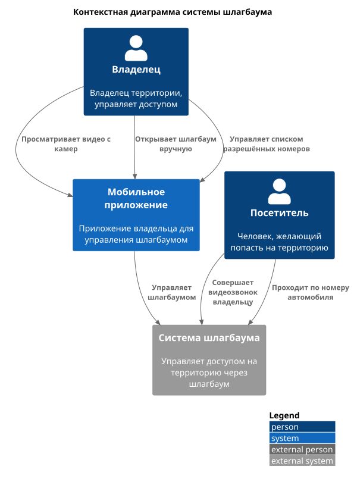
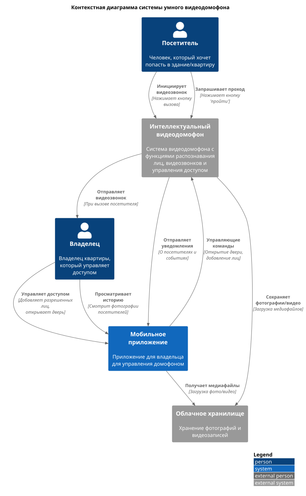
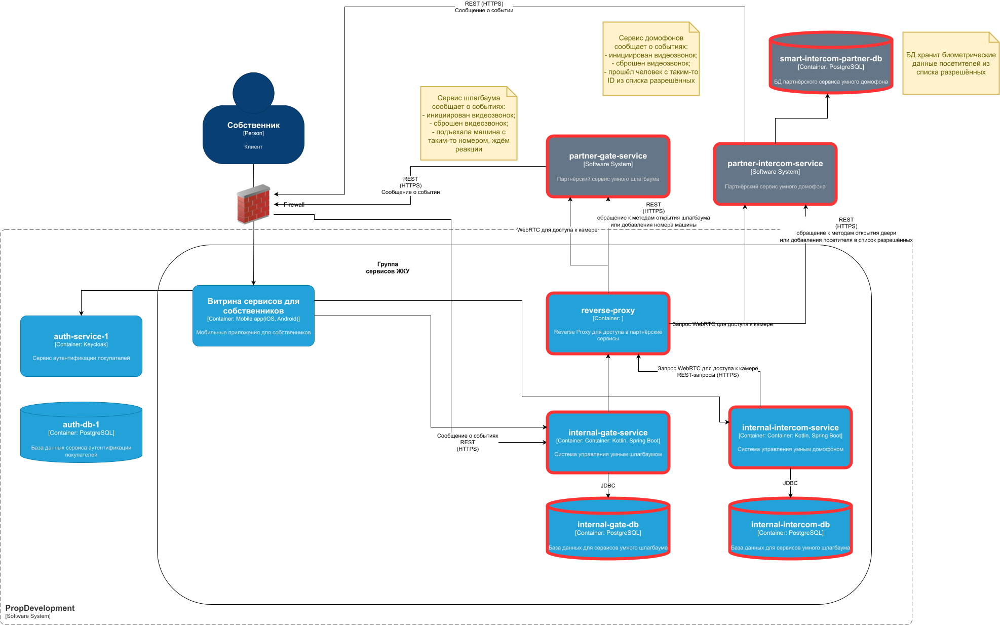

# Задание 3. Внешние интеграции

## Взаимодействие с пользователями
Вазимодействие с пользователями происходит следующим образом.

### Умный шлагбаум
Роли:
- Владелец
- Посетитель

Контексты взаимодействия:
- Владелец смотрит видео с камеры и определившийся номер авто.
- Владелец открывает шлагбаум (разово).
- Владелец добавляет номер авто в список разрешённых.
- Посетитель делает видеозвонок в заданную квартиру.
- Посетитель автоматически проходит, если его номер авто в списке разрешённых.

_Контекстная диаграмма системы умного шлагбаума_

### Умный домофон
Роли:
- Посетитель
- Владелец

Контексты взаимодействия
- Владелец добавляет фотографию посетителя в список разрешённых (фотографию делает сам видеодомофон)
- Владелец просто открывает дверь по видеозвонку.
- Владелец просматривает фотографии всех, кто звонил в домофон или пытался пройти в его квартиру.
- Посетитель инициирует видеозвонок по домофону.
- Посетитель нажимает кнопку "пройти" и проходит через распознавание по фотографии, если он добавлен в список разрашённых.

_Контекстная диаграмма системы умного домофона_

## Взаимодействие с системами компании

### Новые подсистемы
В этой задаче мы покажем новые подсистемы, как партнёрские, так и внутренние:
- партнёрский сервис умного шлагбаума;
- партнёрский сервис умного домофона;
- БД партнёрского сервиса умного домофона (содержит в т.ч. биометрию разрешённых посетителей для сервиса умного домофона);
- внутренний микросервис для работы с умным шлагбаумом;
- БД внутреннего микросервиса умного шлагбаума (содержит, в частности, список разрешённых номеров, добавленных каждым владельцем жилья);
- внутренний микросервис для работы с умным домофоном;
- БД внутреннего микросервиса умного домофона (содержит, в частности, журнал вызовов и фотографии тех, кто звонил в домофон).

_Диаграмма контейнеров: только новые подсистемы (помечено красным)_

### Взаимодействие сервисов умного домофона
Если фото человека есть в БД биометрии:
* Партнёрский сервис умного домофона `partner-intercom-service` открывает дверь, обращается к внутреннему сервису домофона `internal-intercom-service` (через firewall) и передаёт ему сообщение, что пользователь такиим-то ID зашёл в подъёзд.
* `internal-intercom-service` обращается к фронтэнду и отправляет PUSH-уведомление пользователю, что посетитель из списка зашёл в подъезд;

Если фото человека нет в БД биометрии:
* Посетитель набирает номер квартиры и вызывает владельца, при этом `partner-intercom-service` обращается к `internal-intercom-service` (через firewall) и отправляет ему сообщение, что новый посетитель позвонил в дверь (включая UUID звонка и номер квартиры);
* `internal-intercom-service` обращается к фронтэнду, чтобы тот отовестил пользователя, что у него новый посетитель;
* посетитель открывает страницу домофона, при этом фронтэнд запрашивает видеопоток у `internal-intercom-service`;
* `internal-intercom-service` проверяет JWT-токен тользователя, сличает его с UUID звонка и номером квартиры -- и обращается к `partner-intercom-service` за видеопотоком (через Reverse Proxy), транслируя этот видеопоток пользователю на фронтэнд;
* пользователь нажимает кнопку "Открыть" или "Открыть и добавить", обращаясь к `internal-intercom-service` (через firewall), который, в свою очередь, проверяет JWT-токен пользователя, ID звонка -- и обращается к `partner-intercom-service` (через Reverse Proxy), вызывая у него метод добавления нового разрешённого посетителя;
  * после этого происходит либо открытие двери, либо открытие двери + добавление биометрии (фотографии) посетителя в БД `smart-intercom-partner-db`.

### Взаимодействие сервисов умного шлагбаума
Взаимодействие происходит следующим образом.

Если номер найден:
* При въезде автомобиля под камеру умного шлагбаума происходит распознание номеров.
* Партнёрский сервис умного шлагбаума `partner-gate-service` обращается к сервису аутентификации (через firewall) за JWT-токеном.
* `partner-gate-service` обращается к внутреннему сервису шлагбаума `internal-gate-service` (через firewall) и отправляет ему распознанный номер авто. 
* Внутренний сервис шлагбаума ищет номер в своей базе среди разрешённых номеров и находит.
* `internal-gate-service` обращается к `partner-gate-service` (через Reverse Proxy) и отправляет ему команду на открытие ворот.
* `internal-gate-service` обращается к приложению-витрине и отправляет пользователю, добавившему этот номер. PUSH-уведомление, что машина из его списка заехала на территорию.

Если номер не найден:
* Посетитель набирает номер квартиры владельца на цифровой панели рядом со шлагбаумом.
  * `partner-gate-service` обращается к 
* Владелец заходит на страницу шлагбаума в приложении-витрине. 
  * Фронтэнд приложения-витрины на стороне клиента обращается к сервису аутентификации за новым JWT-токеном.
  * Фронтэнд приложения-витрины обращается к `internal-gate-service`, где проверяют его JWT-токен и показывают ему видеотрансляцию с камер у шлагбаума и распознанный номер.
  * `internal-gate-service` обращается к `partner-gate-service` за трансляцией видео и запрашивает у него распознанный номер
* Если пользователь нажал кнопку "Пропустить" или "Пропустить и добавить в список", то `internal-gate-service` обратится к `partner-gate-service` (через Reverse Proxy) и передаст ему команду на открытие шлагбаума -- либо также добавит номер в БД `internal-gate-db` как разрешённый. 

Взаимодействия происходят либо через REST API (HTTPS), либо через WebRTC (для трансляции видеопотока).

## Требования к системам

* при передаче данных используется шифрование по TLS 1.2/1.3;
* используется аутентификация через OAuth 2.0 (для конечных пользователей) и авторизация с использованием JWT через наш сервер авторизации;
* используется проверка сертификатов mTLS.
* используется централизованное логирование всех операций доступа;
* доступ к записям осущестляется по RBAC- или ABAC-модели;
* видео и другие персональные данные на стороне партнёра хранятся в зашифрованном виде (AES-256 или эквивалент);
* ключи шифрования хранятся отдельно, есть управление жизненным циклом ключей;
* чётко определён срок хранения видео (например, 30 дней).
* Для админов систем на стороне партнёра включена MFA.
 
### Дополнительные требования
* Партнёр готов подписать соглашение на передачу персональных данных для обработки (видео и биометрия относятся к персональным данным). 
* Серверы и бэкапы расположены на территории РФ.

